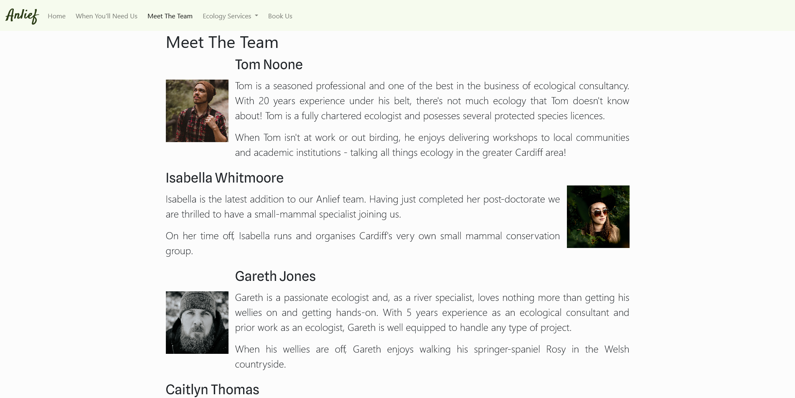
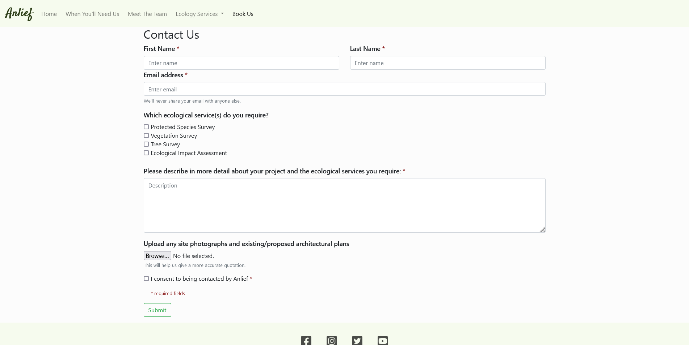

# Anlief Ecological Consultancy

Anlief is a leading Welsh ecological consultancy with the goal of providing high quality consultancy services that safeguard British Wildlife. This website aims to inform users of when ecological services may be required, what type of ecological services may be required and why Anlief are the best consultants for the job. 

This website is targetted towards businesses and individuals that require ecological assessment for works that may go ahead - this covers a wide variety of potential clients (from large-scale vegetation management buisnesses to landowners wanting a large Oak tree removed). This site will enable potential clients to contact Anlief to organise a survey or service. This easy to use and attractive website aims to encourage clients to reach out and enquire about ecological consultancy for their projects, we aim to make the sometimes confusing and daunting process of asking for ecologcial guidance straight-forward and easily accessible.

Image source == http://ami.responsivedesign.is/# --> have screens display different pages
make sure to credit

***

## User Stories

- As a user I want to ............ (features - navbar)
- feature..?
- Contact
- Meet the team

***

## UX

***

### Colour Scheme
Explain colour scheme coolors.co --> website visualises colour scheme
- No accessibility issues were returned when passing the colour scheme through the official [WebAIM](https://webaim.org/resources/contrastchecker/)
    >

### Typography
Explain fonts and font awesome. Put link to respective google fonts and link to font awesome

***

### Wireframes

***

## Features 

### Existing Features 

- __Navigation Bar - *.html__

  - Featured on all pages except for the form submission confimation page, the full responsive navigation bar includes links to the Logo, Home page, When You'll Need Us, Meet The Team, Ecological Services, and Book Us page and is identical in each page to allow for easy navigation.
  - This section will allow the user to easily navigate from page to page across all devices without having to revert back to the previous page via the ‘back’ button. 

    >

- __The landing page image - index.html__

  - The landing includes a photograph with text overlay to allow the user to see quotations from previous satisfied clients. 
  - This section introduces the user to Anlief with an attractive image of a natural scene to grab the users attention and give an earthy feel

    >

- __About Section - index.html__

  - The abouts section will give the user an overview of the Anlief company and why they are considered the best Ecological Consultancy in South Wales. 
  - The user will see the value of Anlief and should be encouraged to consider using Anlief for their ecological consultancy needs. 

    >

- __Map of Location - index.html__

  - This section will show a map of where Anlief is based. 
  - This section will inform users of Anlief's location and is interactive so that users can see how far their project is from Anlief's consultancy team. 

    >

- __The Footer -*.html__ 

  - The footer section includes links to the relevant social media sites for Anlief. The links will open to a new tab to allow easy navigation for the user. 
  - The footer is valuable to the user as it encourages them to keep connected via social media

    >

- __Legislation - legislation.html__

  - This page is for clients who have come to the site unsure if they require ecological consulatation services or not. It will also act as a reminder to knowledgeable clients as to their legal ecological obligations when conducting a project. 
  -  This text-heavy page provides key information on the laws surrounding British wildlife and will direct users to what ecological services they require in order to avoid breaking ecological law.

      >

- __Meet The Team - team.html__

  - This page will give users more information about the ecologists that work at Anlief. Academic and professional information will be provided alongside a picture of the ecologist to give a more personable feel.
  - This page will allow users to check ecologists credentials and will confirm the legitimacy and professionalism of the consultancy.

    >

- __Book Us - form.html__

  - This page will allow the user to contact Anlief to recieve a quotation/futher information about their project requirements. The user will be able specify what ecological service they believe they require, a brief description of the project they want to undertake and will also be able to upload files i.e., pictures of project site or blueprints. The user will be required to submit their full name, email address, select an ecological service, and consent to being contacted by Anlief. 

    >

### Features Left to Implement 

- Carousel of quotations on the Home page overlay
  - This component would allow users to see several positive reactions to our ecology services from previous clients. This would give a user eassurance that Anlief are a professional and competent company.
  - This feature hasn't yet been implimented as Bootstrap currently does not support nested carousels, and this quotation box is nested within the hero-image. Once I have an understanding of JavaScript this feature will be easier to impliment as I am unable to automate the scroll behaviour to automatically scroll between the quotations.

- Search bar in navigation
  - This component would be particularly useful for clients who already know the ecological service they require and so will easily be able to search for that service to see if Anlief offer it. 
  - This component would additionally be useful for users to search through the website for specific laws/legislations that may be applicable to their project and ecological obligations. 
  - At this stage in development it is not fundamental, but if there was going to be additional information added about wildlife and ecology in the UK (e.g., list and description of British Protected Species, why they're protected and how to meet legal ecological obligations as to not disturb these animals) then this feature would need to be implemented. Additionally, I do not currently have the skillset in JavaScript to confidently implement this feature.

***

## Technologies
List bullet points all technologies used - link to expalin what theyre used for
[HTML] (link to wiki) - markup lang
CSS (same) - styles
GitPod - cloud based iDE
GitHub - secure online
GitHub Pages (link deployed site)
Git (https://git-scm.com/) - version control
Am I Responsive - mockup img
Bootstrap - layout and responsive components
Dev Tools - testing and responsiveness

***

## Testing

To view all testing documentation, refer to [TESTING.md](TESTING.md).

***

## Deployment

The site was deployed to GitHub pages. The steps to deploy are as follows: 
  - In the [GitHub repository](https://github.com/antonia-white/anlief-ecological-consultancy), navigate to the Settings tab 
  - From the source section drop-down menu, select the **Main** Branch, then click "Save".
  - The page will be automatically refreshed with a detailed ribbon display to indicate the successful deployment.

The live link can be found [here](https://antonia-white.github.io/anlief-ecological-consultancy/)

### Local Deployment

In order to make a local copy of this project, you can clone it. In your IDE Terminal, type the following command to clone my repository:

- `git clone https://github.com/antonia-white/anlief-ecological-consultancy.git`

Alternatively, if using Gitpod, you can click below to create your own workspace using this repository.

***

## Credits 

### Content 

- Text content for the 'When You'll Need Us' page was sourced from the [Chartered Institute of Ecology and Environmental Management (CIEEM)](https://www.google.com/url?sa=t&rct=j&q=&esrc=s&source=web&cd=&ved=2ahUKEwiI08j61771AhVJasAKHUbeCkUQFnoECAUQAQ&url=https%3A%2F%2Fcieem.net%2Fwp-content%2Fuploads%2F2019%2F02%2FA_Householders_Guide_to_Engaging_an_Ecologist_Jan_2016.pdf&usg=AOvVaw27QZ4sNnf1YrchAxfwxQ6-) and [Ecology by Design](https://www.ecologybydesign.co.uk/ecology-resources/ecology-survey-planning-permission)
- Text content for the 'Protected Species' card on the 'Ecology Services' page was adapted from [The Ecology Partnership](http://www.ecologypartnership.com/category/protected-species-surveys/)
- Text content for the 'Vegetation' card on the 'Ecology Services' page was adapted from [ECOSA](https://ecosa.co.uk/survey-and-assessment-services/vegetation-surveys/#.Yet-2_jLeUk)
- Text content for the 'Tree' card on the 'Ecology Services' page was taken from [AllAboutTrees](http://www.allabouttrees.co.uk/tree-surveys.htm)
- Text content for the 'Ecological Impact Assessment' card on the 'Ecology Services' page was adapted from [EcologyByDesign](https://www.ecologybydesign.co.uk/ecology-resources/ecological-impact-assessment-guidelines-process-overview-and-lead-times)
- All other text throughout the website is self-written
- Framework for the navigation component was taken and adapted from [Bootstrap](https://getbootstrap.com/docs/5.1/getting-started/introduction/)
- Templates for the 'Book Us' page were taken and then adapted from [Bootstrap](https://getbootstrap.com/docs/5.1/getting-started/introduction/)
- Framework for the 'Meet The Team' media objects were taken and adapted from [Bootstrap](https://getbootstrap.com/docs/5.1/getting-started/introduction/)
- Instructions on how to implement the hero image and cover-text was taken from a [Code Institute Tutorial](https://learn.codeinstitute.net/courses/course-v1:CodeInstitute+CSE101+2020_Q2/courseware/be0e510a3aca4bccb6e0bba4cf7cf06b/83c6c94d55f44c79a3646810d80ce7a3/)
- Instructions on how to embed a google map of Anleif's location were learnt from [Campus WCMS](https://wcmshelp.ucsc.edu/advanced/embedding-google/google-maps.html)
- The icons in the footer were taken from [Font Awesome](https://fontawesome.com/)
- Instructions for creating a footer using bootstap were taken from [MDB](https://mdbootstrap.com/docs/b4/jquery/navigation/footer/) and adapted from information taken from a [Code Institute Tutorial](https://learn.codeinstitute.net/courses/course-v1:CodeInstitute+CSE101+2020_Q2/courseware/be0e510a3aca4bccb6e0bba4cf7cf06b/cbb28fc16a35417bb73450e0dc71d59b/). This was futher formatted with information taken from [Stack Overflow](https://stackoverflow.com/questions/10099422/flushing-footer-to-bottom-of-the-page-twitter-bootstrap)

### Media

- The photo used on the Home page are from the open source site [Upsplash](https://unsplash.com/)
- The images used for the headshots on the Meet The Team page were taken from the open source site [Pexels](https://www.pexels.com/)
- Media images used in the Meet The Team page were cropped to size with [Safeimagekit](https://safeimagekit.com/)
- Media images used in the Ecological Services page were resized and cropped with [ResizePixel](https://www.resizepixel.com/)
- The favicon image is from the open source site [Favicon.io](https://favicon.io/emoji-favicons/herb)

***
