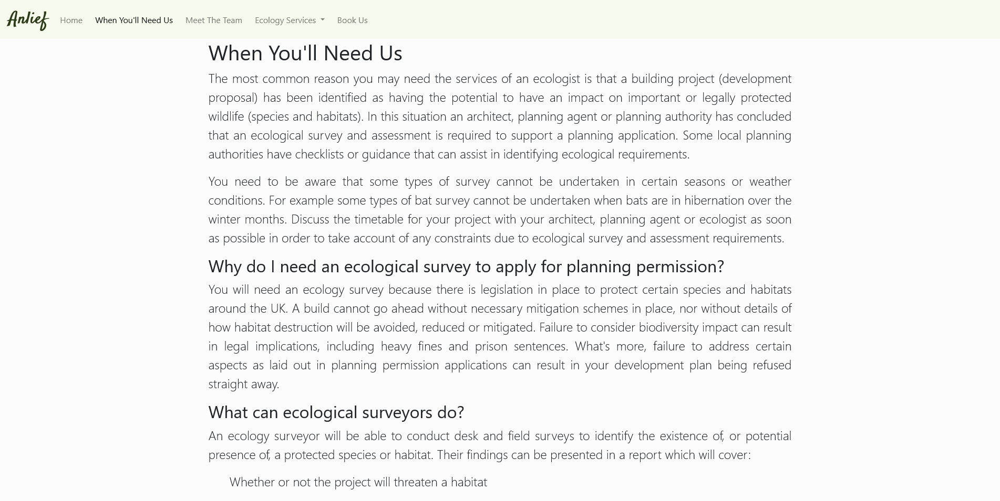

# Testing 

***

## Validator Testing 

At the time of testing (18:00 22/01/2022) [W3C's markup validator](https://validator.w3.org/) was down.

    >

And so [FreeFormatter](https://www.freeformatter.com/html-validator.html) was used as a HTML Validator instead.

- HTML
  - No errors were returned in the index.html file when passing through the official [FreeFormatter's Validator](https://www.freeformatter.com/html-validator.html)

    >

  - No errors were returned in the legislation.html file when passing through the official [FreeFormatter's Validator](https://www.freeformatter.com/html-validator.html)

    >

  - No errors were returned in the team.html file when passing through the official [FreeFormatter's Validator](https://www.freeformatter.com/html-validator.html)

    >

  - No errors were returned in the services.html file when passing through the official [FreeFormatter's Validator](https://www.freeformatter.com/html-validator.html)

    >

  - No errors were returned in the form.html file when passing through the official [FreeFormatter's Validator](https://www.freeformatter.com/html-validator.html)

    >

  - No errors were returned in the confirmation.html file when passing through the official [FreeFormatter's Validator](https://www.freeformatter.com/html-validator.html)

    >

- CSS
  - No errors were found when passing through the official [(Jigsaw) validator](https://jigsaw.w3.org/css-validator/validator?uri=https%3A%2F%2Fvalidator.w3.org%2Fnu%2F%3Fdoc%3Dhttps%253A%252F%252Fcode-institute-org.github.io%252Flove-running-2.0%252Findex.html&profile=css3svg&usermedium=all&warning=1&vextwarning=&lang=en#css)
  https://jigsaw.w3.org/css-validator/validator?uri=https%3A%2F%2Fantonia-white.github.io%2Fanlief-ecological-consultancy

    >

***

## Unfixed Bugs 

To the best of my knowledge, there are no unfixed-bugs.

***

## Browser Compatability

- Website launched successfully on [Firefox](https://www.mozilla.org/en-GB/firefox/new/):

  >

- Website launched successfully on [Google Chrome](https://www.google.com/intl/en_uk/chrome/):

  >

- Website launched successfully on [Microsoft Edge](https://www.microsoft.com/en-us/edge):

  >

***

## Responsivness

- Website viewed in a mobile device:

  >

- Website viewed in a tablet device:

  >

- Website viewed in a laptop device:

  >

***

## User Story Testing

A target user of Anlief's website, will want to:
    1. navigate through the website and it's pages easily and fluidly
      >
    2. know where Anlief is based
      >
    3. know more about the company and what their aims are
      >
    4. visit an attractive website for an enjoyable experience
      >
    5. know if Anlief is a respectable company
      >
    6. have information that informs me of when and why I might need a ecologist
      >
    7. be shown what ecological services anlief provide
      >
    8. be able to easily contact an ecologist
      >
    9. see who works for Anlief and look at their credentials
      >

***
